# Question Classification Flow Diagram

## AI-First Hybrid Classification System

```mermaid
flowchart TD
    A[User Question Input] --> B[Pronoun Resolution]
    B --> C{Check Conversation History}
    C -->|Has History| D[Resolve Pronouns with Context]
    C -->|No History| E[Keep Original Question]
    D --> F[AI Classification Attempt]
    E --> F
    
    F --> G{AI Model Available?}
    G -->|Yes| H[🤖 AI Classification Call]
    G -->|No| P[⚠️ Pattern Matching Fallback]
    
    H --> I{AI Confidence ≥ 60%?}
    I -->|Yes| J[✅ Use AI Result]
    I -->|No| K[⚠️ Low Confidence - Pattern Fallback]
    
    J --> L[🔍 Enhanced Mixed Intent Check]
    L --> M{Pattern Matching Detects<br/>Mixed Intent AI Missed?}
    M -->|Yes| N[🔧 Enhance AI Result with<br/>Mixed Intent Detection]
    M -->|No| O[📋 Return AI Classification]
    
    N --> O
    K --> P
    
    P --> Q[Fast Pattern Analysis]
    Q --> R{has_gratitude?}
    Q --> S{has_greeting?}
    Q --> T{has_capability?}
    Q --> U{has_technical?}
    
    R -->|Yes| V{Also Technical?}
    S -->|Yes| W{Also Technical?}
    T -->|Yes| X{Also Technical?}
    U -->|Yes| Y{Pure Technical?}
    
    V -->|Yes| Z1[🔄 Mixed: Gratitude + Technical<br/>Type: WILDLIFE_TECHNICAL<br/>Confidence: 80%]
    V -->|No| Z2[💭 Pure Gratitude<br/>Type: GRATITUDE<br/>Confidence: 95%]
    
    W -->|Yes| Z3[🔄 Mixed: Greeting + Technical<br/>Type: WILDLIFE_TECHNICAL<br/>Confidence: 80%]
    W -->|No| Z4[👋 Pure Greeting<br/>Type: GREETING<br/>Confidence: 95%]
    
    X -->|Yes| Z5[🔄 Mixed: Capability + Technical<br/>Type: WILDLIFE_TECHNICAL<br/>Confidence: 80%]
    X -->|No| Z6[❓ Pure Capability<br/>Type: CAPABILITY<br/>Confidence: 95%]
    
    Y -->|Yes| Z7[🦎 Pure Technical<br/>Type: WILDLIFE_TECHNICAL<br/>Confidence: 85%]
    Y -->|No| Z8[🤷 Default Fallback<br/>Type: GENERAL_ENVIRONMENTAL<br/>Confidence: 60%]
    
    O --> AA[Classification Complete]
    Z1 --> AA
    Z2 --> AA
    Z3 --> AA
    Z4 --> AA
    Z5 --> AA
    Z6 --> AA
    Z7 --> AA
    Z8 --> AA
    
    AA --> BB{Should Use Context?}
    BB -->|Yes| CC[🔍 Context Retrieval]
    BB -->|No| DD[🚫 Skip Context]
    
    CC --> EE[Build Prompt with Context]
    DD --> FF[Build Prompt without Context]
    
    EE --> GG[🤖 Generate Response]
    FF --> GG
    
    GG --> HH[Stream Response to User]

    style A fill:#e1f5fe
    style H fill:#c8e6c9
    style J fill:#a5d6a7
    style O fill:#81c784
    style P fill:#ffcc02
    style AA fill:#4caf50
    style GG fill:#2196f3
    style HH fill:#ff9800
```

## Classification Method Priorities

### 1. **AI-First Approach** 🤖
- **Priority**: Primary method for accuracy
- **Confidence Threshold**: ≥ 60%
- **Enhanced with**: Pattern matching for missed mixed intent
- **Context Hint**: `ai_primary` or `ai_enhanced_mixed_intent`

### 2. **Pattern Matching Fallback** 🔍 
- **Triggered when**: AI fails, times out, or low confidence
- **Strength**: Fast, reliable for obvious cases
- **Context Hints**: `pattern_greeting`, `pattern_gratitude`, `pattern_capability`, `pattern_technical`, `pattern_mixed_intent`

### 3. **Default Fallback** 🤷
- **Last resort**: When no patterns match
- **Classification**: `GENERAL_ENVIRONMENTAL` with 60% confidence
- **Context Hint**: `default_fallback`

## Question Type Hierarchy

## Mixed Intent Detection Logic

```mermaid
flowchart LR
    A[Input Question] --> B{Contains Gratitude<br/>Keywords?}
    A --> C{Contains Greeting<br/>Keywords?}
    A --> D{Contains Technical<br/>Keywords?}
    
    B -->|Yes| E{Also Technical?}
    C -->|Yes| F{Also Technical?}
    
    E -->|Yes| G[🔄 MIXED INTENT<br/>Primary: Technical<br/>Secondary: Gratitude]
    F -->|Yes| H[🔄 MIXED INTENT<br/>Primary: Technical<br/>Secondary: Greeting]
    
    E -->|No| I[💭 Pure Gratitude]
    F -->|No| J[👋 Pure Greeting]
    D -->|Yes + No Others| K[🦎 Pure Technical]
    
    style G fill:#fff3e0
    style H fill:#fff3e0
    style I fill:#e8f5e8
    style J fill:#e8f5e8
    style K fill:#e3f2fd
```

## Performance & Efficiency Features

### Combined AI Calls (New Chats)
- **Efficiency**: 1 AI call for heading + classification
- **Timeout**: 7 seconds with fallback
- **Adaptive**: Disables if >50% timeout rate

### Separate Classification (Existing Chats)  
- **Reliability**: Proven approach for ongoing conversations
- **Fallback**: Always available when combined calls fail

### Context Decision Matrix

| Question Type | Use Context | Rationale |
|---------------|-------------|-----------|
| GREETING | ❌ | Keep responses fresh |
| GRATITUDE | ❌ | Standard acknowledgment |
| CAPABILITY | ❌ | Static capabilities info |
| WILDLIFE_TECHNICAL | ✅ | Needs specific data |
| CONSERVATION_TECHNICAL | ✅ | Needs specific data |
| GENERAL_ENVIRONMENTAL | ✅ | May benefit from context |
| OFF_TOPIC | ❌ | Redirect only |

## Logging & Monitoring

Each classification includes:
- **Method Used**: AI Primary, Pattern Fallback, etc.
- **Confidence Score**: 0-100%
- **Mixed Intent**: Yes/No with secondary types
- **Context Decision**: Used/Skipped with reasoning
- **Performance**: Response times and success rates

This AI-first system prioritizes accuracy while maintaining speed and reliability through intelligent fallbacks!
